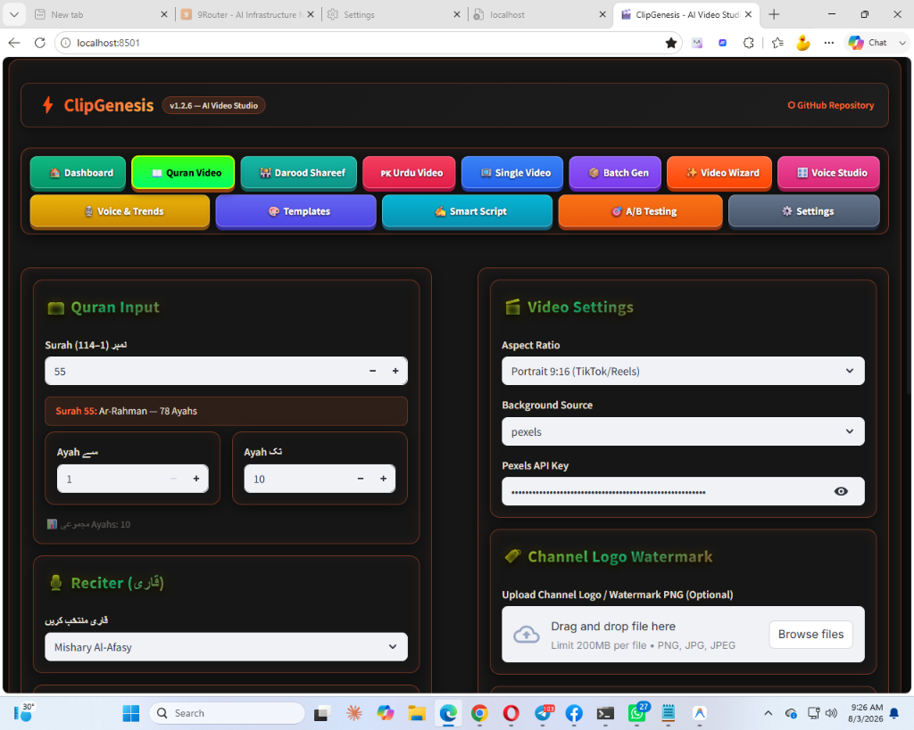
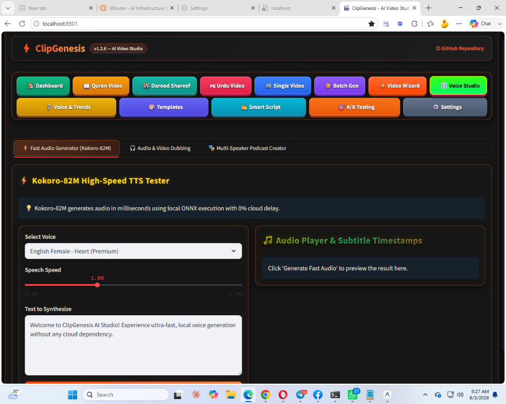
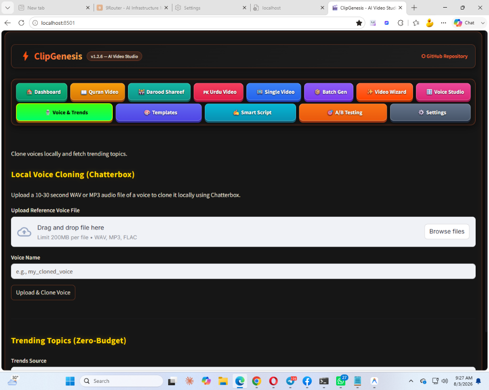
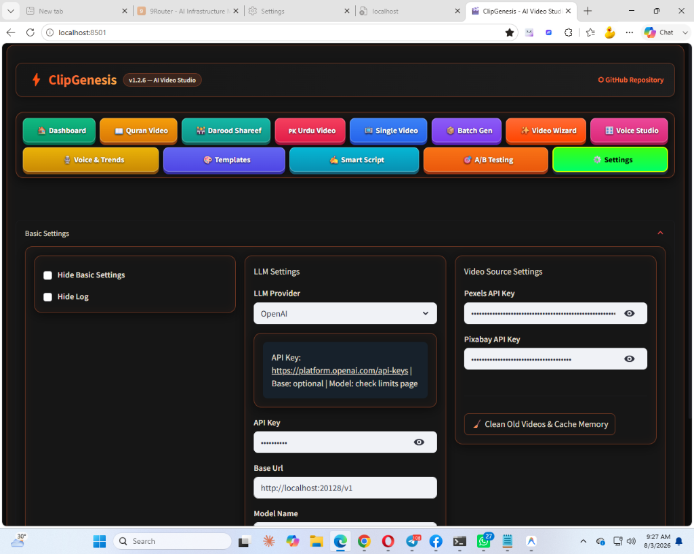

# ClipGenesis AI Studio

A powerful, full-featured AI Short Video Generation Studio, Quran & Islamic Video Studio, and Voice Studio. Powered by Python, Streamlit, FastAPI, MoviePy, and state-of-the-art TTS & LLM models.

[](https://github.com/sahilali2550/ClipGenesis-ai-studio.git)
[](https://python.org)
[](https://streamlit.io)
[](https://fastapi.tiangolo.com)
[](https://developer.nvidia.com/cuda-toolkit)

---

## 🖼️ Dashboard & Studio Showcase

<div align="center">

### 🕌 Quran Video Studio


<br/>

### 🎬 PK Urdu Video Creator Studio


<br/>

### 🎙️ Kokoro-82M High-Speed TTS & Voice Studio
| **Kokoro-82M High-Speed TTS** | **Local Voice Cloning (Chatterbox)** |
| :---: | :---: |
|  |  |

</div>

---

## 🌟 Key Features

### 🎬 AI Short Video Generator
- **Automatic Scripting**: Built-in LLM providers (OpenAI, Azure, DeepSeek, G4F) for instant viral video script generation.
- **Smart Media Matching**: High-definition video and image searching from Pexels, Pixabay, or local asset libraries using semantic keyword mapping.
- **Dynamic Subtitle Highlighting**: Word-by-word active highlighting with full timing synchronization, custom colors, fonts, and stroke styling.
- **Audio & BGM Processing**: Smart background music ducking, volume balance, and automatic video audio blending.

### 🕌 Quran & Darood Video Studio
- **RTL Arabic & Urdu Support**: Native rendering of Uthmanic Hafs Arabic script and Nastaliq Urdu fonts.
- **Verse-by-Verse Synchronization**: Precise reciter timing alignment with word/line highlighting.
- **Custom Aesthetic Themes**: Built-in visual presets and particle effects for high-engagement Islamic reels/shorts.

### 🎙️ Voice Studio & Multi-Engine TTS
- **Open-Source & Cloud TTS**: Support for Edge-TTS, Azure TTS, Kokoro TTS, and Chatterbox Voice Cloning.
- **Voice Cloning**: Clone any voice using 10-60 seconds of clean reference audio.
- **Pacing & Speed Controls**: Fine-grained speech weight and duration threshold management.

---

## 🚀 Quick Start

### 1. Clone Repository & Setup Environment

```bash
git clone https://github.com/sahilali2550/ClipGenesis-ai-studio.git
cd ClipGenesis-ai-studio
```

#### On Windows (Automated):
Run the launcher script:
```powershell
.\run_webui.bat
```
*(Or for API Backend)*
```powershell
.\run_api.bat
```

#### On Linux / Conda Environment:
```bash
conda env create -f environment.yml
conda activate ClipGenesis

# Launch Web Interface
./webui.sh
```

### 2. Configuration
Copy `config.example.toml` to `config.toml` and configure your API keys:
```toml
# config.toml
[pexels]
api_key = "YOUR_PEXELS_API_KEY"

[openai]
api_key = "YOUR_OPENAI_API_KEY"
```

Web Interface accessible at `http://localhost:8501`.

---

**Usage:**
```bash
# Web Interface (Recommended)
./webui.sh            

## Optional: Customize speech speed when using chatter box
export CHATTERBOX_CFG_WEIGHT=0.1  # Very slow
export CHATTERBOX_CFG_WEIGHT=0.2  # Slow (default)
export CHATTERBOX_CFG_WEIGHT=0.3  # Normal speed
```

The web interface opens at `http://localhost:8501`

## 🔧 Troubleshooting

<details>
<summary><strong>Common Issues & Solutions (Click to expand)</strong></summary>

**Chatterbox TTS issues:**
- **Garbled audio**: Text automatically preprocessed and chunked for clarity
- **CUDA errors**: System automatically falls back to CPU mode
- **Force CPU mode**: `export CHATTERBOX_DEVICE=cpu`
- **Voice cloning problems**: Ensure audio is clear and single-speaker
- **Speed control**: Use `CHATTERBOX_CFG_WEIGHT` environment variable

**CUDA/cuDNN compatibility issues:**
- **Error**: `libcudnn_ops_infer.so.8: cannot open shared object file`
- **Cause**: Missing cuDNN 8.x libraries required by some packages
- **Solution**: Automatically handled by startup scripts (`setup_cuda_env.sh`)
- **Manual fix**: `pip install nvidia-cudnn-cu12==8.9.2.26`

**MoviePy TextClip issues:**
- **Error**: `got an unexpected keyword argument 'align'`
- **Cause**: Newer MoviePy versions removed the `align` parameter
- **Solution**: Remove or comment out `align` parameter in `TextClip` calls

**General issues:**
- Check that all dependencies are installed correctly
- Ensure your Python environment is activated
- For GPU issues, CPU mode provides a reliable fallback

**Advanced CUDA Setup:**
The project includes automatic CUDA environment configuration:
- `setup_cuda_env.sh` - Shared CUDA environment setup
- `webui.sh` - Web interface with CUDA support

If you encounter CUDA library issues, the startup scripts automatically:
1. Add cuDNN library paths to `LD_LIBRARY_PATH` (Linux) 
2. Set optimal CUDA memory allocation settings

</details>

## Contributions and Support 

If you found this project useful please give it a star and consider contributing to it or open an issue if you have an idea that can make it more useful.

## Original Project Credits

This fork maintains full compatibility with the original ClipGenesis while adding new features. Check out the [original repository](https://github.com/harry0703/ClipGenesis) for the base project documentation and additional features.
